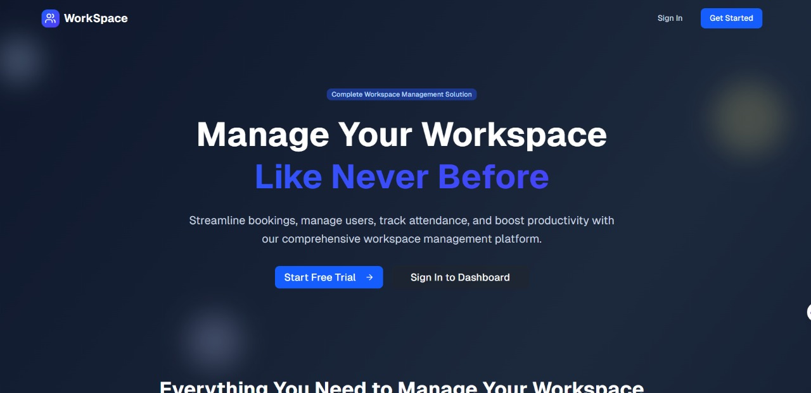

# 🏨 Workspace Managment System Frontend



> **A modern, responsive, and high-performance hotel booking platform** built with **React**, **Tailwind CSS**, and smooth animations — designed for seamless integration with a backend API.

---

## 🚀 Tech Stack
- **⚛️ React** – Component-based architecture for reusability and scalability.
- **🎨 Tailwind CSS** – Utility-first styling for fast and responsive design.
- **🎞 Framer Motion** – Smooth animations & transitions.
- **🌐 Axios / Fetch** – API integration for backend communication.
- **📱 Fully Responsive** – Optimized for mobile, tablet, and desktop.

---

## ✨ Features Overview

### 🖥 Frontend UI
- **🏠 Homepage** – Showcases featured hotels, offers, and a search bar.
- **🔍 Hotel Search & Filter** – Search by location, date, and guest count.
- **📝 Booking Form** – Complete form with validation for reservations.
- **📜 Hotel Details Page** – Room types, prices, and amenities.
- **📅 Calendar Picker** – Easy date selection for check-in & check-out.
- **🔄 Real-Time UI Updates** – React state management for instant feedback.
- **📱 Mobile Friendly** – Optimized layout for all devices.

---

### 📡 API Endpoints Integration (Planned)
All form submissions and data fetching are prepared for backend connection:
- **`GET /hotels`** → Fetch all available hotels.
- **`GET /hotels/:id`** → Fetch single hotel details.
- **`POST /bookings`** → Submit a new booking.
- **`GET /bookings/:id`** → Retrieve booking details.
- **`PUT /bookings/:id`** → Update booking information.
- **`DELETE /bookings/:id`** → Cancel a booking.

---

## 🧭 Folder Structure
```

src/
│── assets/          # Images, icons, and static files
│── components/      # Reusable UI components
│── pages/           # Page-level components (Home, HotelDetails, BookingForm)
│── hooks/           # Custom React hooks
│── services/        # API calls & endpoint handlers
│── styles/          # Global styles & Tailwind config
│── App.jsx          # Main app component
│── main.jsx         # Entry point

````

---

## 🛠 Installation & Setup

```bash
# Clone the repository
git clone https://github.com/Mohamed2007Sarhan/workspace-frontend.git

# Navigate into the project folder
cd workspace-frontend

# Install dependencies
npm install

# Start the development server
npm run dev
````

---

## 📌 Notes

* The project is **frontend-only** for now, but is fully prepared to connect with a backend.
* All API endpoints are already mapped in the service layer.
* Backend can be built with **Node.js**, **Laravel**, or any REST API framework.

---

## 📷 Preview


---

## 📄 License

This project is licensed under the MIT License – feel free to use, modify, and share.

```
